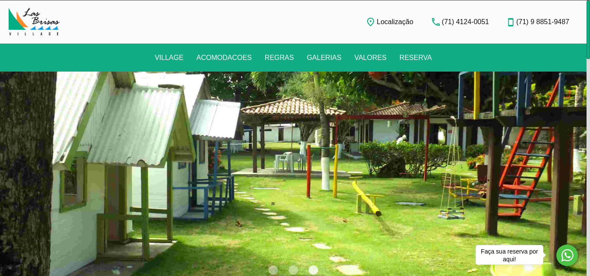

# Village Las Brisas
> Site para divulgação da pousada, e facilitar a demonstração de fotos, valores e regras do estabelecimento.

[![Code Size][code-size]][code-url]
[![License][MIT-license]][MIT-url]

Site para divulgação da pousada, e facilitar a demonstração de fotos, valores e regras do estabelecimento.

<p align="center">
    </img>
</p>

## 🎯 Objetivo

Site para divulgação da pousada, e facilitar a demonstração de fotos, valores e regras do estabelecimento.

## 👷 Instalação

Clone o repositório:

```git
git clone https://github.com/villagelasbrisas/villagelasbrisas.com.br
```

## 👨🏼‍💻 Autor

Foto | Nome | GitHub | Likedin | E-mail
---- | ---- | ------ | ------- | ------
 | Guilherme Caires | [gcairesdev](https://github.com/gcairesdev) | [Linkedin](https://linkedin.com/in/guilherme-caires/) | contatogcaires@gmail.com

## 🤝 Contribuindo

Confira a página [CONTRIBUTING](.github/CONTRIBUTING.md) para ver os melhores locais para arquivar problemas, iniciar discussões e começar a contribuir.

## 📃 Licença

Lançado em 2020.
Este projeto está sob a [Licença MIT](./LICENSE.md).

---

<p align="center">
    Feito com :heart: por <a href="https://github.com/gcairesdev">Guilherme Caires</a>
</p>

[code-size]: https://img.shields.io/github/languages/code-size/gcairesdev/project-template
[code-url]: https://github.com/gcairesdev/project-template

[MIT-license]: https://img.shields.io/github/license/gcairesdev/project-template
[MIT-url]: https://github.com/gcairesdev/project-template/blob/master/LICENSE.md
